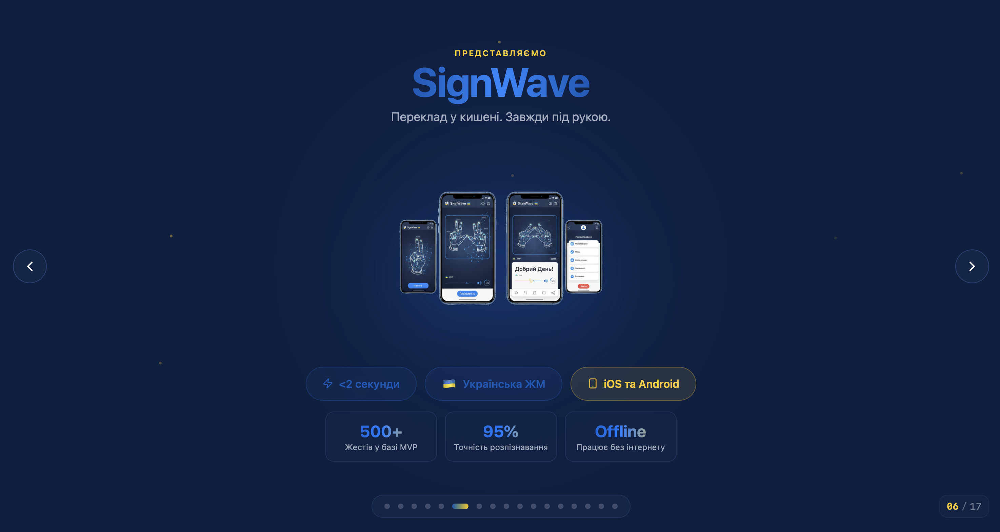
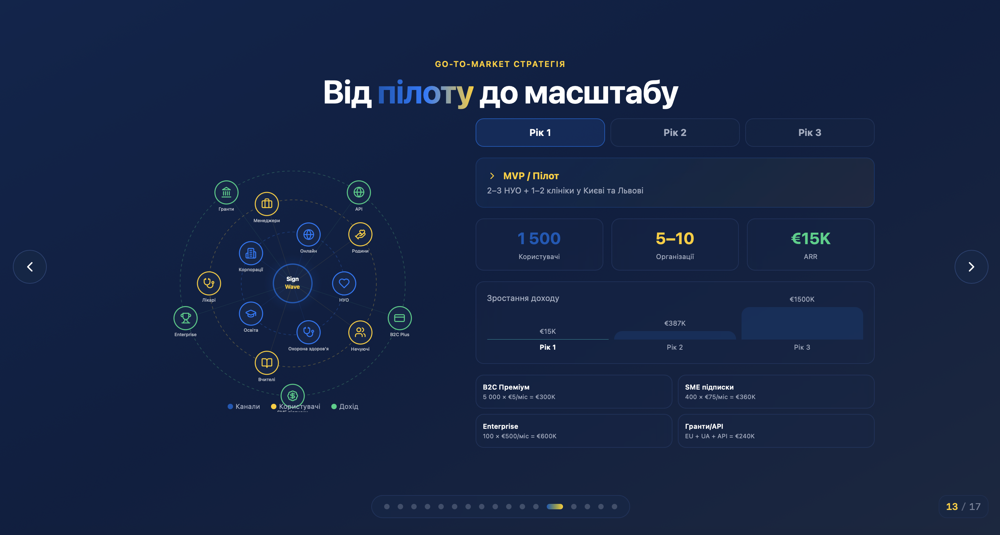
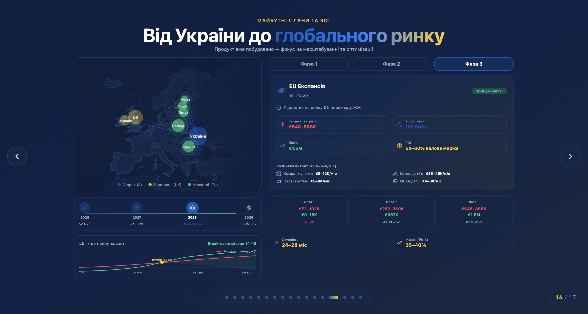

# SignWave - Ukrainian Sign Language Translator

**Demo:** https://mriya-wave.co.uk

> **🥈 2nd Place** - **Ukrainian Student Business Hackathon**  
> ⚡ Real-Time Computer Vision and Sequence Learning System

---

---

## Overview

SignWave is a real-time system that translates Ukrainian Sign Language (USL) into spoken language using computer vision and deep learning.
It is designed for environments where interpreters are unavailable (clinics, schools, public services).

In Ukraine, at least 30,600 people are officially registered with hearing impairments, while global estimates indicate 1.5B people with some degree of hearing loss.
Primary use cases include hospitals, schools, government offices, and customer service desks.

---

## How It Works

- Capture live video from a webcam or device camera
- Detect hands and upper-body landmarks with MediaPipe
- Encode keypoints and aggregate short temporal windows
- Classify sequences with a Bi-LSTM model
- Render text output and generate speech with ElevenLabs

---

## Core Features

- Real-time multi-landmark tracking (hands + upper body)
- Temporal gesture recognition using sequence models
- Continuous inference via sliding windows
- Low-latency local execution
- Text + speech output

---

## Architecture

- Client UI (React/Vite)
- Streaming backend (Flask) with video ingestion
- Computer vision pipeline (OpenCV + MediaPipe)
- Feature encoding and sequence windowing
- Bi-LSTM inference service (PyTorch)
- Output layer (text + ElevenLabs speech)

---

## Tech Stack

| Layer | Technologies |
|------|--------------|
| Frontend Experience | React, Vite, Tailwind CSS, Framer Motion |
| Backend & APIs | Python, Flask, Werkzeug |
| Computer Vision & Tracking | OpenCV, MediaPipe Holistic |
| Machine Learning | PyTorch (Bi-LSTM) |
| Voice | ElevenLabs |
| Runtime | Python, CUDA |
| Deployment | Docker |
| Testing | PyTest |

---

## Business Track Context

- Target users: people with hearing impairments + service staff
- Primary settings: healthcare, education, government, customer support
- Model: free access for end users, subscriptions for institutions

---

## Why It Matters

- Full real-time ML pipeline, not a demo script
- Sequence-based modeling, not static pose classification
- Practical deployment use case, not a toy project
- Clear social + enterprise value
